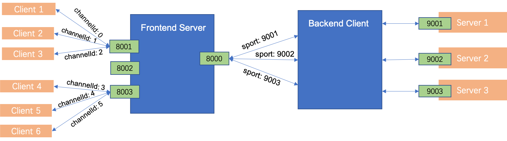

# Netty LAN Proxy

[](https://travis-ci.org/ZiheLiu/JavaMavenTeamplate)

Proxy server and client for Local Area Network (LAN) using netty.

## 组织结构



### 内网服务

内网的服务分别部署在 9001、9002、9003 端口上。

### 代理服务

Frontend Server 是代理服务。

8000 端口建立与代理客户端的 TCP 隧道。

8001、8002、8003 分别将接收到的数据包通过 8000 端口的隧道传递给代理客户端

### 代理客户端

Frontend Client 是代理客户端。

向代理服务的 8000 端口，建立 3 个 TCP 连接，分别用来传输 9001、9002、9003 的数据包。

- 用8001、8002、8003 标识这 3 个 TCP 隧道。

## 请求流程

### Client -> Server

以 client 向请求 9001 的 Server 为例。

1. Client 向代理服务的 8001 建立 TCP 连接，发送数据包。
2. 代理服务受到数据包后，根据 8001 端口，找到对应的与代理客户端的 TCP 隧道。
3. 赋予客户端 channel 一个 channelId，以 channelId 标识客户端的 TCP 连接。
4. 通过隧道，把channelId + 数据包 传递给代理客户端。
5. 代理客户端与 9001 端口建立 TCP 连接，把数据包传递给 9001 端口的 Server。

### Server -> Client

1. 9001 端口的 Server 向刚刚与代理客户端建立的 TCP 连接发送数据包。
2. 通过隧道，代理客户端将 channelId + 数据包 传递给代理服务端。
3. 服务端根据 channelId 找到客户端的 TCP 连接，把数据包传递给这个 TCP 连接。

## Dependencies

- `Maven` > 3.0
- `Java` > 8.0


## TODO

- [ ] Use `Junit` to test.
- [ ] Use `travis` to build after push to GitHub.


## Usages

### 生成SSL证书

```shell
# 生成server私钥和证书仓库
$ keytool -genkey -alias netty-lan-proxy-server -keysize 2048 -validity 365 -keyalg RSA -dname "CN=localhost" -keypass sNetty -storepass sNetty -keystore server.jks

# 生成server自签名证书
$ keytool -export -alias netty-lan-proxy-server -keystore server.jks -storepass sNetty -file server.cer


# 生成client密钥对和证书仓库
$ keytool -genkey -alias netty-lan-proxy-client -keysize 2048 -validity 365 -keyalg RSA -dname "CN=localhost" -keypass cNetty -storepass cNetty -keystore client.jks

# 生成client签名证书
$ keytool -export -alias netty-lan-proxy-client -keystore client.jks -storepass cNetty -file client.cer


# 将server的证书导入到client的证书仓库中
$keytool -import -alias netty-lan-proxy-server -trustcacerts -file server.cer -storepass cNetty -keystore client-trust.jks

# 将client的证书导入到server的证书仓库中
keytool -import -alias netty-lan-proxy-client -trustcacerts -file client.cer -storepass sNetty -keystore server-trust.jks  
```

### 运行
```shell
$ mvn clean test

$ mvn clean package
```
