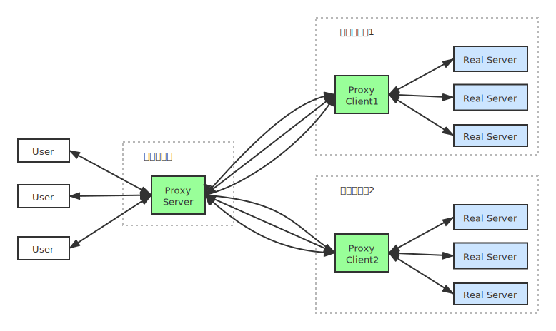

# Netty LAN Proxy

[](https://travis-ci.org/ZiheLiu/JavaMavenTeamplate)

Proxy server and client for Local Area Network (LAN) using netty.

## 组织结构



### 内网服务

内网部署了多个服务，如图中蓝色所示。

### 代理服务

Proxy Server 是代理服务，部署在公网服务器上。

监听两种端口。

1. 一个端口。负责建立与 Proxy Client 之间的 TCP 连接通道。
2. 多个端口。每个端口负责一个被代理的服务，内存存储 `listenedPort` -> `realServerPort` 的映射。

### 代理客户端

Proxy Client 是代理客户端，部署在内网服务器上，需要能够访问到需要被代理的服务。

可以有多个 Proxy Client。

每个 Proxy Client 向 Proxy Server 主动发起多次 TCP 连接请求。这样在 Proxy Server 与 Proxy Client 间建立了多个 TCP 连接，二者可以通过这些连接相互发送数据。

## 请求流程

### User -> Real Server

#### Proxy Server

1. Proxy Server 与用户建立 TCP 连接后，
   - 为这个 TPC 连接分配一个编号 `channelId`，存储 `channelId` 到 `clientChannel` 的映射。
   - 解析出是哪个端口接收到的请求 `listenedPort`，找到对应的 `realServerPort`。
   - 从与 Proxy Client 的多个 TCP 通道中选择一个，之后这个用户的连接都是用这个 TCP 通道转发数据。
2. 收到用户的数据，
3. 用自定义协议把数据包进行封装：消息长度(2 bytes) + 消息类型(1 byte) + `channelId`(4 bytes) + `realServerPort` (2byte) + 数据包。

#### Proxy Client

1. Proxy Client 收到 Proxy Server 的数据包后，解析封装的数据包，存储 `channelId` 与 `proxyChannel` 的映射关系。。
2. 看 `channelId` 是否已经与 `realServerPort` 的 Real Server 建立了 TCP 连接。
   - 如果没有建立，则发起 TCP 连接请求 `serverChannel`，存储 `channelId` 与 `serverChannel` 的映射关系。
   - 建立连接后，使用这个连接发送数据。

### Server -> Client

#### Proxy Client

1. Proxy Client 收到 Real Server 的请求后，根据 `serverChannel` 找到 `channelId`。
2. 通过 `channelId` 找到 `proxyChannel`。
3. 封装数据包。
4. 用 `proxyChannel` 发送数据包给 Proxy Server。

#### Proxy Server

1. Proxy Server 解析数据包，得到 `channelId`。
2. 用 `channelId` 找到 `clientChannel`。
3. 把数据包发送给 `clientChannel`。

## 优化

- 使用 VisualVM 发现 `wait()` 和 `select()` 占 CPU 比率比较靠前。Proxy Server 与 Proxy Client 之间建立多个 TCP 连接，避免所有数据都通过一个连接发送、成为瓶颈。
- 使用 VisualVM 发现 CAS 占 CPU 比率比较靠前。`LengthFieldBasedFrameDecoder` + `ProxyDecoder` 改为 `ProxyDecoder` 继承 `LengthFieldBasedFrameDecoder`，避免过长的 `piepline`、多次 retain/release（需要 CAS 更新引用计数）。
- 使用 VisualVM 发现 allocate 占 CPU 比率比较靠前。`ProxyEncoder` 中使用 `CompositeByteBuf` 组装数据。
- 心跳机制：
  - 客户端每隔一段时间（5s）向服务端发起心跳请求。
  - 服务端如果隔了 5s 没有收到心跳请求，就关闭这个socket连接。
  - 客户端如果发现 TCP 连接断开了，就发起重启连接的尝试。每次失败后尝试时间增长。
- 使用抽象工厂模式，不同平台使用不同的 `ServerSocketChannel`、`SocketChannel`、`EventLoopGroup`。

## Dependencies

- `Maven` > 3.0
- `Java` > 8.0


## TODO

- [ ] Use `Junit` to test.
- [ ] Use `travis` to build after push to GitHub.


## Usages

### 生成SSL证书

```shell
# 生成server私钥和证书仓库
$ keytool -genkey -alias netty-lan-proxy-server -keysize 2048 -validity 365 -keyalg RSA -dname "CN=localhost" -keypass sNetty -storepass sNetty -keystore server.jks

# 生成server自签名证书
$ keytool -export -alias netty-lan-proxy-server -keystore server.jks -storepass sNetty -file server.cer


# 生成client密钥对和证书仓库
$ keytool -genkey -alias netty-lan-proxy-client -keysize 2048 -validity 365 -keyalg RSA -dname "CN=localhost" -keypass cNetty -storepass cNetty -keystore client.jks

# 生成client签名证书
$ keytool -export -alias netty-lan-proxy-client -keystore client.jks -storepass cNetty -file client.cer


# 将server的证书导入到client的证书仓库中
$keytool -import -alias netty-lan-proxy-server -trustcacerts -file server.cer -storepass cNetty -keystore client-trust.jks

# 将client的证书导入到server的证书仓库中
keytool -import -alias netty-lan-proxy-client -trustcacerts -file client.cer -storepass sNetty -keystore server-trust.jks  
```

### 运行
```shell
$ mvn clean test

$ mvn clean package
```
